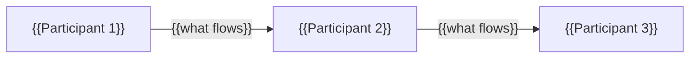

# {{Segment name}}

> {{Definition in 1–2 sentences: what it is, which problem it solves, for whom.}}

📌 **Key insight:** {{one thing to remember}}

## 1. Definition and boundaries

- **In scope:** {{…}}
- **Out of scope (and where it is covered):** {{…}}

### Sub-segments

| Sub-segment | Essence | Examples | Card |
|---|---|---|---|
| {{…}} | {{…}} | {{companies}} | {{link or "coming"}} |

### Value chain

## 2. Market size and growth

| Metric | Value | Year | Type (Rev/Vol/Stock/MR) | Source | Confidence |
|---|---|---|---|---|---|
| {{…}} | {{…}} | {{…}} | {{…}} | {{…}} | {{A/B/C}} |

- **Regional split:** {{…}}
- **Why estimates differ:** {{…}}

## 3. Key players

| Company | Country | Sub-segment | Scale (metric, date) | Status | Card |
|---|---|---|---|---|---|
| {{…}} | {{…}} | {{…}} | {{…}} | {{…}} | {{link}} |

- **Regional leaders:** {{table by region}}
- **Incumbents and their response:** {{…}}

## 4. Business models

| Model | Mechanics | Typical margin | Who uses it |
|---|---|---|---|
| {{…}} | {{…}} | {{X% (source)}} | {{…}} |

## 5. Unit economics and key metrics

| Metric | Formula | Benchmark | Why it matters |
|---|---|---|---|
| {{…}} | {{…}} | {{…}} | {{…}} |

**Worked example:** {{revenue per unit − direct costs − risk or losses = contribution margin}}

## 6. Regulation

| Region | Key requirements | Licences / standards | Regulators | Document |
|---|---|---|---|---|
| {{…}} | {{…}} | {{…}} | {{…}} | {{link to 06-Regulations}} |

## 7. Trends

| Trend | What is happening | Leaders | Horizon | Card |
|---|---|---|---|---|
| {{…}} | {{…}} | {{…}} | {{<1 / 1–3 / 3+ years}} | {{link}} |

## 8. Customer pain points

| Pain | Who suffers | Frequency | Signal source | Who solves it / gap |
|---|---|---|---|---|
| {{…}} | {{…}} | {{…}} | {{…}} | {{…}} |

## 9. Opportunities and threats

| 💡 Opportunities | ⚠️ Threats |
|---|---|
| {{…}} | {{…}} |

## 10. Cases

| Company | What went right or wrong | Lesson |
|---|---|---|
| {{…}} | {{…}} | {{…}} |

## 🎯 Angle for you

| Question | Answer |
|---|---|
| Typical roles or entry points | {{…}} |
| Core problems and north-star metrics | {{…}} |
| Typical interview or diligence questions | {{…}} |

## 🔗 Links

- Adjacent segments: {{…}} · Companies: {{…}} · Regulation: {{…}} · Trends: {{…}}

## ❓ Open questions

- [ ] {{question → where to check}}
